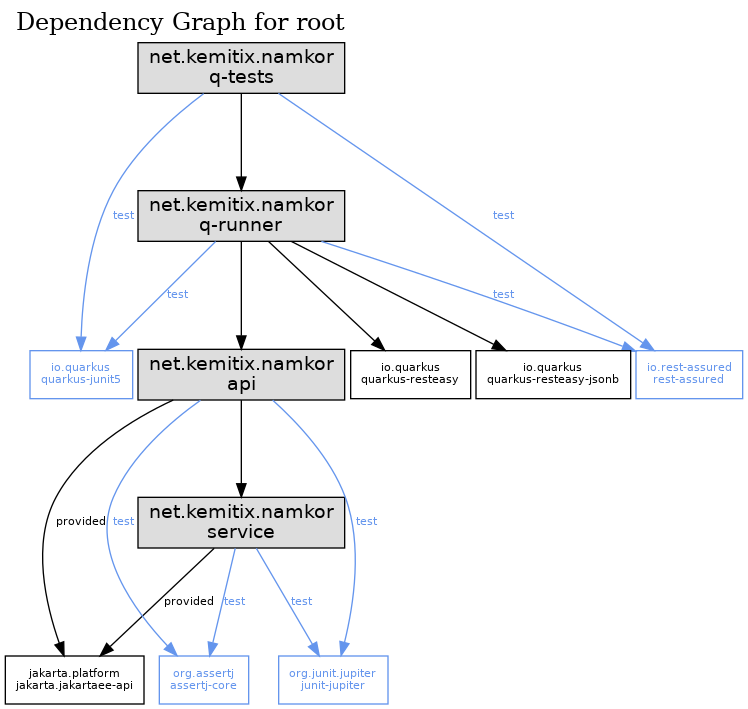

# Quarkus Multi-module Archetype


This project provides a Maven Archetype for creating a multi-module project with Quarkus.

## Usage:

Replace `${RELEASE}` with the latest version as shown above.

```bash
mvn archetype:generate
  -DarchetypeGroupId=net.kemitix
  -DarchetypeArtifactId=quarkus-multi-module-archetype
  -DarchetypeVersion=${RELEASE}
```

See the generated project's [README](./src/main/resources/archetype-resources/README.md) for details.

## Structure/Dependencies

The generated project has the following structure and dependencies.


